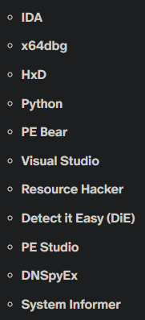

### Description 

Download VM Image of Windows (eval version is enough)
- [Windows VM Image](https://developer.microsoft.com/en-us/windows/downloads/virtual-machines/) (currently taken down)

I'm experimenting with ReviOS to get at least somewhat better performance
- [Revision Playbook](https://github.com/meetrevision/playbook)
- if you are using older windows version, check for release that supports that version
- easier to run flareVM

Lastly, install tools with FlareVM
- [Flare VM](https://github.com/mandiant/flare-vm)
- but not all, only some

Try using CAPE?
- [CAPEv2](https://github.com/kevoreilly/CAPEv2)